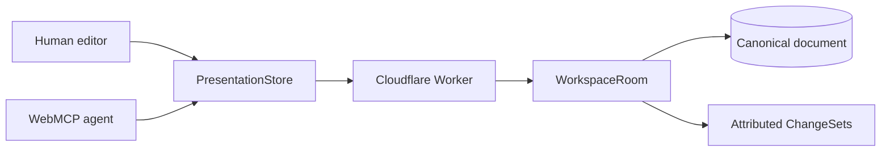
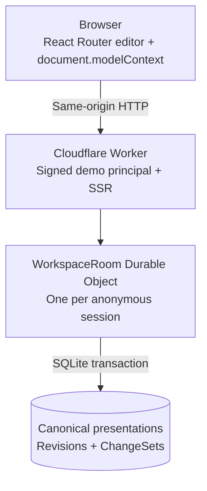

# Comake

**A shared presentation workspace for humans and agents.**

People edit visually on the canvas. Agents work through native WebMCP tools exposed by the current page. Both operate on the same canonical presentation, and every accepted change is attributed and reversible.

[Open the live demo](https://comake.duz52.com)

> Comake is currently an anonymous public demo. A signed browser cookie isolates each workspace; accounts, sharing, and cross-session collaboration are not implemented yet.

## Why WebMCP

Traditional browser agents reconstruct an application from screenshots and simulate clicks. Comake exposes the editor's meaning directly:

- the slide the human is viewing;
- the exact elements the human selected;
- stable slide, element, comment, and change-set IDs;
- canonical `960 × 540` geometry, z-order, text, and styles;
- one atomic mutation vocabulary shared with the human editor;
- revision conflicts and validation failures as structured results.

An agent can therefore understand and change the artifact without reading the DOM, estimating coordinates from pixels, or depending on the current visual theme.



## Use Comake through WebMCP

Use a browser or agent host that implements the native `document.modelContext` API. Comake registers tools for the page currently open in the browser. It does not expose a separate chatbot or proprietary agent runtime.

### 1. Start from the workspace

Open [comake.duz52.com](https://comake.duz52.com). The workspace page registers:

| Tool | Purpose |
| --- | --- |
| `get_workspace_context` | Read the template catalog and this session's presentations. Results include stable IDs and editor URLs; project pages are bounded to 50 entries with an opaque pagination cursor. |
| `create_presentation` | Create a blank presentation or copy a known template. Returns the new project ID, initial slide ID, and editor URL. |

`create_presentation` does not navigate. Open the returned `editorUrl` through the agent host before calling editor tools.

### 2. Read the human's current focus

The editor page registers `get_presentation_context` as its starting point. It returns:

- the canonical document `revision`;
- an independent `focusRevision` that advances when the human changes slide or selection;
- presentation ID and title;
- the active slide's stable ID, one-based index, name, and title;
- every selected element with its full canonical value, frame, rotation, lock state, and z-index;
- the coordinate-space dimensions and orientation.

The result is read from the live editor store at invocation time. A screenshot is not required to discover what the human is working on.

### 3. Read only the detail you need

| Tool | Purpose |
| --- | --- |
| `get_presentation_context` | Current document revision, active slide, and human selection. Start here. |
| `get_presentation_spatial_map` | Compact z-ordered canvas geometry for one slide, optionally filtered by region or name/text query. |
| `get_presentation_outline` | Every slide's stable ID, name, title, and element count. |
| `read_presentation_slide` | Complete canonical slide, including full styles and comments. |
| `list_presentation_changesets` | The latest 12 attributed change sets and their operation counts. |

Read tools are marked with `annotations.readOnlyHint: true`. Prefer the compact spatial map for placement work, and request the complete slide only when exact styles or comments are needed.

### 4. Apply one atomic change

`apply_presentation_operations` accepts a label, the revision last read, and one or more operations. For example:

```json
{
  "baseRevision": 12,
  "label": "Rewrite the selected heading",
  "operations": [
    {
      "type": "update_text",
      "slideId": "slide-id-from-context",
      "elementId": "element-id-from-selection",
      "expectedText": "The current heading",
      "text": "A clearer heading"
    }
  ]
}
```

The current operation vocabulary is:

```text
update_text             update_text_style       update_frame
update_shape_style      update_element_order    update_slide
update_presentation     create_slide            delete_slide
create_element          delete_element          add_comment
remove_comment          resolve_comment
```

Operations use stable IDs returned by the read tools. Styles are complete replacements, frames must remain inside the canonical canvas, colors use `#RRGGBB`, and an exact element-order update must be a permutation of the current IDs.

The batch is all-or-nothing. A stale `baseRevision` returns `STALE_REVISION`; invalid input or a failed optimistic guard rejects the entire batch without partially editing the deck. Re-read context, reconsider the human's latest work, and then submit a new intent rather than replaying an old mutation blindly.

### 5. Collaborate and finish

| Tool | Purpose |
| --- | --- |
| `add_presentation_comment` | Attach an agent-attributed question or note to a slide and optionally an element. |
| `resolve_presentation_comment` | Resolve a comment by stable ID. |
| `export_presentation_pptx` | Download the current canonical deck as `.pptx` in the browser. |

Agent writes travel through the same dispatch owner and canonical kernel as human edits. The Worker derives identity from the signed session instead of trusting actor data from the client. Accepted writes become attributed ChangeSets visible in the UI; agent ChangeSets can be reverted.

## Integrating WebMCP in the codebase

The WebMCP boundary is intentionally thin:

1. Route-specific hooks obtain `document.modelContext`.
2. Each page builds a strict JSON Schema tool set.
3. `startWebMcpRegistration` registers the complete set with one `AbortController` generation.
4. Route teardown aborts obsolete registrations so a previous page cannot retain tools or overwrite readiness.
5. Read tools project the current store state; write tools dispatch canonical operations.

Key implementation files:

| Path | Responsibility |
| --- | --- |
| `app/lib/workspace/tools.ts` | Workspace tool definitions and structured transport results. |
| `app/lib/workspace/webmcp.ts` | Workspace registration lifecycle. |
| `app/lib/presentation/webmcp.ts` | Presentation read, mutation, comment, history, and export tools. |
| `app/lib/presentation/webmcp-registration.ts` | Abort-safe native tool registration. |
| `app/lib/presentation/operations.ts` | Strict parsers and JSON Schema for the shared operation contract. |
| `app/lib/presentation/document.ts` | Pure canonical mutation kernel. |

Browsers without `document.modelContext` retain the complete human editor and honestly show WebMCP as unavailable.

## Current product surface

- Slide editor with text and rectangle, ellipse, triangle, and diamond shapes.
- Direct text editing, multi-selection, move, eight-handle resize, alignment, and z-order.
- Inspector, context actions, selection actions, command palette, shortcuts, and slide rail.
- Blank presentations and the WebMCP launch-deck template.
- Human undo/redo, agent ChangeSet reversion, comments, presentation mode, and `.pptx` export.
- Light, dark, and system themes.

The canonical model currently supports text and shapes. Image media, PPTX import, multiplayer presence, accounts, and share links are not implemented.

## Architecture



`WorkspaceRoom` is the single atomic owner of a session's projects. The browser store is an ephemeral mirror and owns only view state such as selection and zoom. Canonical mutations are validated by the pure presentation kernel and persisted with listing metadata in the same SQLite transaction.

The demo cookie is HMAC-signed, `HttpOnly`, `SameSite=Lax`, and `Secure` on HTTPS. State-changing requests require the exact same origin. This provides anonymous demo isolation, not recoverable user authentication: deleting or expiring the cookie loses access to that workspace.

## Develop locally

Requirements: Node.js `>=22.22.0`, pnpm `11.20.0`, and a WebMCP-capable browser for agent integration.

```bash
pnpm install
openssl rand -base64 32
```

Store the generated value in the gitignored `.dev.vars` file:

```dotenv
DEMO_SESSION_SECRET=replace-with-your-generated-secret
```

Then run and validate:

```bash
pnpm dev
pnpm typecheck
pnpm run build
pnpm run deploy:dry-run
```

## Deploy

Comake targets Cloudflare Workers with a SQLite-backed `WORKSPACE_ROOM` Durable Object. Configure the required secret and deploy:

```bash
pnpm wrangler secret put DEMO_SESSION_SECRET
pnpm deploy
```

## Stack

React 19 · React Router 8 · TypeScript · Tailwind CSS 4 · Base UI · Vite 7 · Cloudflare Workers · Durable Objects with SQLite · pnpm

## License

[Apache License 2.0](LICENSE) © 2026 duz52
